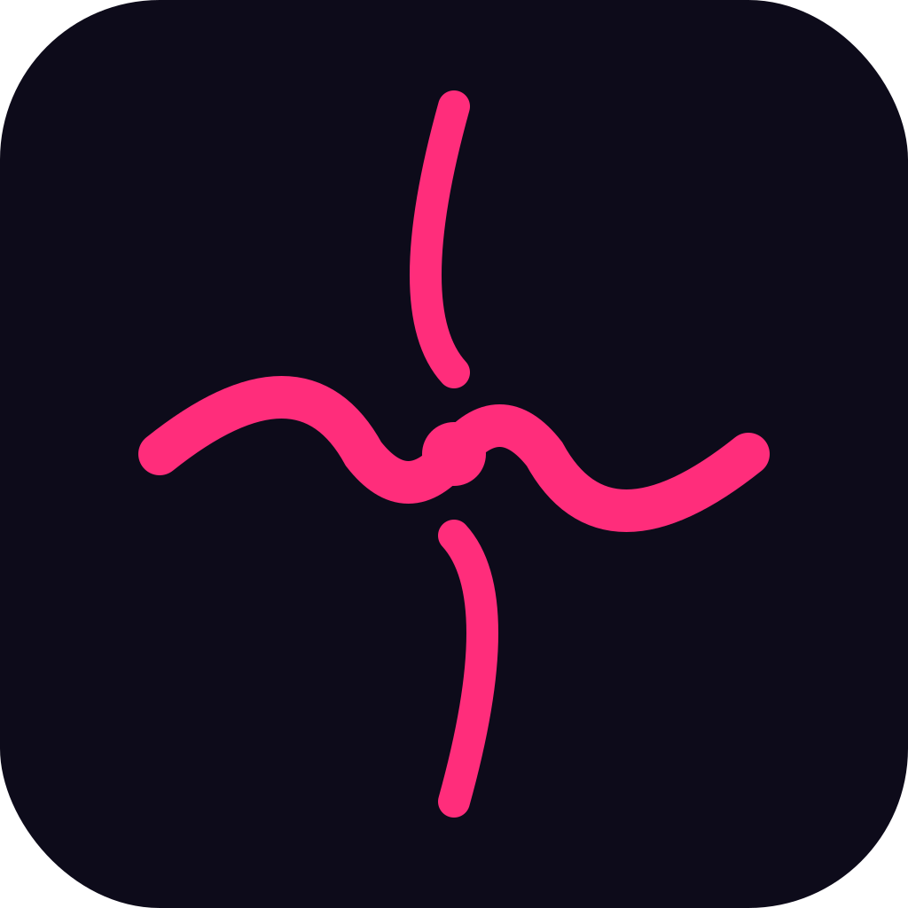
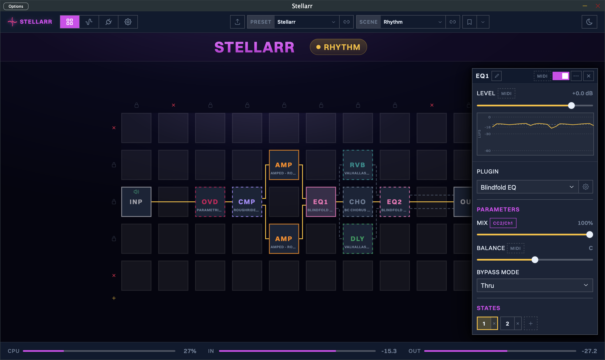

<p align="center">
  
</p>

<h1 align="center">STELLARR</h1>

<p align="center">
  Open-source signal processing for musicians.<br/>
  Build custom audio chains with any VST3 or Audio Unit plugin you already own.
</p>

<p align="center">
  <a href="https://github.com/stellarr-audio/stellarr/actions/workflows/ci.yml"></a>
  <a href="https://github.com/stellarr-audio/stellarr/actions/workflows/github-code-scanning/codeql"></a>
</p>

<p align="center">
  <a href="https://stellarr.org">Website</a> &middot;
  <a href="https://stellarr.org/docs/">Docs</a> &middot;
  <a href="docs/CONTRIBUTING.md">Contributing</a> &middot;
  <a href="LICENSE">Licence</a>
</p>

<p align="center">
  
</p>

## What is Stellarr?

Stellarr is a virtual pedalboard and amp rack that you design yourself. Arrange plugins on a visual grid, connect them with drag-and-drop wiring, and switch between configurations instantly during a live performance.

It was made by an AI and a human, together. It is free and open, forever. For the love of all human expression.

## Features

- **Signal chain on a grid** -- Place Input, Output, and Plugin blocks on a visual grid. Drag wires between them to build your chain. Splice new blocks into existing connections automatically.
- **Host any plugin** -- Load VST3 and Audio Unit plugins. Open their native editor, control their parameters, and blend them with per-block mix, balance, and level controls.
- **States and scenes** -- Save up to 16 parameter snapshots per plugin block. Group them into scenes that recall your entire rig in one click -- verse, chorus, solo, whatever you need.
- **Instant scene switching** -- Swap between scenes with no audio gap. Plugins stay loaded; only their settings change.
- **Full MIDI control** -- Map any CC to block bypass, mix, balance, level, scene switching, or tuner toggle. Use Program Change to switch presets. MIDI Learn auto-detects your controller.
- **Live signal tracing** -- Select a block to highlight its full end-to-end route in amber. Connections outside the active path fade so you can see exactly where your signal goes.
- **Built-in tuner** -- Chromatic tuner with large stage-readable display. Auto-mutes output while tuning.
- **Output metering** -- Real-time output level in dBFS with clipping detection.
- **Copy-paste blocks** -- Duplicate any block with its plugin, states, and parameters.
- **Presets** -- Save your entire rig (blocks, connections, scenes, states, MIDI mappings) as a `.stellarr` file.

## Platform Support

Stellarr currently targets **macOS on Apple Silicon** only. Windows and Linux support may come in the future.

## Installation

### Download

Check the [Releases](../../releases) page for the latest macOS (Apple Silicon) build.

### Build from source

Requires macOS on Apple Silicon, CMake 3.24+, Xcode Command Line Tools, and Node.js 18+.

```
git clone https://github.com/stellarr-audio/stellarr.git
cd stellarr
make dev       # build UI + engine
make run       # launch the app
```

The first build fetches JUCE via git and compiles the `juceaide` tool, which takes several minutes.

See [Contributing](docs/CONTRIBUTING.md) for the full development guide.

## Documentation

The [user manual](https://stellarr.org/docs/) covers everything from quick start to MIDI mapping. Markdown sources live at [`docs/manual/`](docs/manual/); dev test cases at [`docs/testing/`](docs/testing/).

To browse the site locally with hot reload:

```
make docs
```

Then open [http://localhost:4321](http://localhost:4321).

## Privacy

Stellarr includes optional crash reporting powered by [Sentry](https://sentry.io). It is **off by default** and only activates when you explicitly opt in via the System tab.

When enabled, only anonymous crash data is sent (stack traces, app version, OS version). No plugin names, preset content, audio data, file paths, or personal information is ever collected. If you don't opt in, no data leaves your machine.

Stellarr also checks for software updates on launch and once a day by fetching `stellarr.org/appcast.xml` — standard for any auto-updating macOS app. The check sends only what any HTTP request sends (IP, user-agent including the current app version). Sparkle's optional "system profile" feature that would otherwise report your hardware is explicitly disabled. Nothing is downloaded or installed without you clicking **Download & Install**.

The website itself (stellarr.org) uses [GoatCounter](https://www.goatcounter.com) for cookie-free visitor counting — no personal data, no fingerprinting, no consent banner needed.

Full details in the [Privacy & Telemetry](https://stellarr.org/docs/privacy/) page.

## Licence

[GNU Affero General Public License v3.0](LICENSE)
